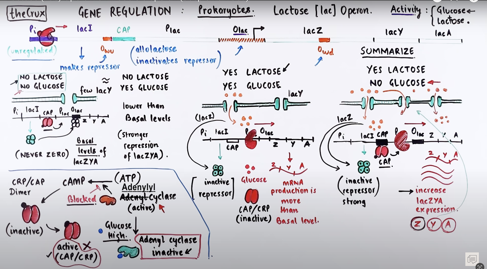
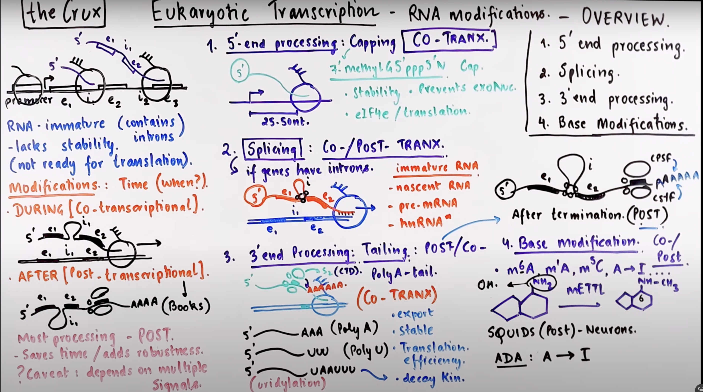

## [Lac operon](https://www.youtube.com/watch?v=ajFLReouZrU): 

### Lac operon 

### No lactose

### Yes lactose (inducer allolactose)

### CRP and glucose lactose all yes

### summary 

___

## 21.7: 这段话描述的是乳糖代谢中所需酶的需求和协同作用情况。这里提到的酶主要涉及乳糖（一种β-半乳糖苷）的分解和代谢。让我们逐步解析这段话：

1. **"enzymes needed for beta-galactosides metabolism"**：
   - 这指的是参与β-半乳糖苷（如乳糖）代谢的酶。在大肠杆菌等微生物中，这主要包括β-半乳糖苷酶（负责将乳糖分解成葡萄糖和半乳糖），以及其他可能涉及的转运和加工酶。
2. **"not always needed"**：
   - 这意味着这些酶不是在所有情况下都必需的。这些酶的需求依赖于细胞外部环境中β-半乳糖苷的存在与否。例如，如果细胞外环境中没有乳糖，那么细菌就不需要合成β-半乳糖苷酶等相关酶。
3. **"always needed together (1 metabolic route)"**：
   - 这表示当需要这些酶时，它们通常是一起需要的，因为它们协同作用在同一代谢途径中。在乳糖的代谢中，β-半乳糖苷酶的作用是第一步，必须有乳糖进入细胞（通过乳糖渗透酶，即LacY蛋白的作用），然后才能进行下一步的代谢。这意味着这些酶在代谢乳糖时是作为一个整体运作的，它们在一个共同的代谢路径上相互依赖。

---

## 21.9 [Euaryotic RNA processing](https://www.youtube.com/watch?v=UteY3Iah88Q) (stop at the base modification)

---

## 22.2 [Transfer RNA](https://www.youtube.com/watch?v=rEQDWIARmVY)

---

## 22.5 [Initiation of translation](https://youtu.be/q8BPMK10IrY?si=g5F48Fj3bU8ivL-U&t=362) only for Prokarytotic beings 

For the Eukaryotes, they are relatively the same except scanning. 

---

## 22.6 [Elongation](https://www.youtube.com/watch?v=UHuGGMSR8DQ): 

**氨基酸的连接**：特定的酶，称为氨基酸tRNA合成酶（aminoacyl-tRNA synthetases），负责将适当的氨基酸与对应的tRNA分子连接。这个过程涉及高度的选择性，每种氨基酸tRNA合成酶只识别并催化一种或几种特定的tRNA与相对应的氨基酸形成结合。

**充电过程**（Charging）：在氨基酸被连接到tRNA的CCA端时，形成了一个称为氨基酰-tRNA的复合物。这个过程也被称为“充电”，过程中消耗了一个ATP分子以形成高能的酰胺键（ester bond），这样氨基酸就被活化了。

充电后的氨基酰-tRNA会被运送到核糖体的翻译位点。在这里，tRNA的抗密码子与mRNA的相应密码子进行互补配对，确保正确的氨基酸按照遗传密码的指示被逐一加入到多肽链中。

## 22.7 [Termination](https://www.youtube.com/watch?v=dTPhQxKqu7Q)

## 22.9 Regulation of protein synthesis

### Ribosomal protein synthesis is coupled to ribosome assembly in E.coil 

在大肠杆菌（E. coli）这样的细菌中，核糖体基因（ribosomal genes）通常以几乎等摩尔比（equimolar amounts）表达的现象，是由于其基因组中这些基因的排列和转录机制的特殊性。这种表达方式确保了核糖体组装的效率和正确性，因为核糖体的组装需要各种rRNA和核糖体蛋白以准确匹配的比例合成。以下是几个关键因素，解释了为什么大肠杆菌中的核糖体基因通常以几乎等摩尔的量表达。

[E.coil](https://www.youtube.com/watch?v=qIwrhUrvX-k) focus on the Trp

