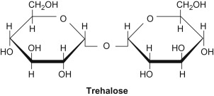
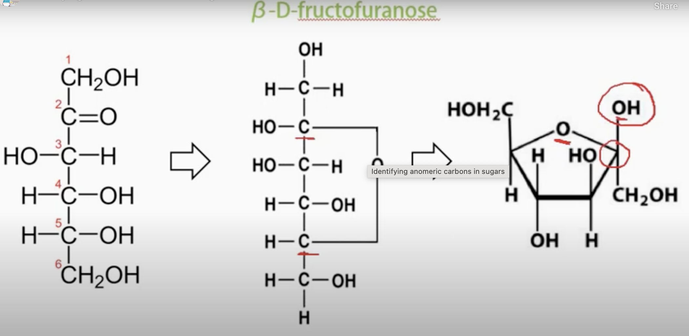

# Part 1.

1. Calculate the net charge at pH = 7.4? compare with pk and pH, accumulate the net charge. 

2. If we want to attach N-linked sugar to the peptide, which amino acid can we link? **O\-linked glycosylation** is the attachment of a [sugar](https://en.wikipedia.org/wiki/Sugar) molecule to the [oxygen](https://en.wikipedia.org/wiki/Oxygen) atom of [serine](https://en.wikipedia.org/wiki/Serine) (Ser) or [threonine](https://en.wikipedia.org/wiki/Threonine) (Thr) residues in a protein. N-linked glycosylation is **the attachment of an oligosaccharide, a carbohydrate consisting of several sugar molecules, sometimes also referred to as glycan, to a nitrogen atom** (the amide nitrogen of an asparagine (Asn) residue of a protein), in a process called N-glycosylation

3. Given the same peptide but no N-terminus acetylation, how does the pI change? **Without Acetylation**: The pI of the peptide would likely be higher because the free amino group at the N-terminus contributes an additional positive charge. This would shift the balance towards more basicity, thus increasing the pH at which the peptide has a net zero charge. 

4. If we have mixture of 2 peptides mentioned above (one with acetylated N-terminus and one with free N-terminus), how can we separate them? (choose between anion exchange at pH 7.4, cation exchange at pH 7.4 or gel filtration chromatography)? The peptide with a free N-terminus typically carries a positively charged amine group under physiological pH conditions (like pH 7.4), unless it is a particularly acidic peptide. On the other hand, acetylation neutralizes the positive charge at the N-terminus by converting the free amine group (NH3+) into an acetyl group (COCH3-NH), which is neutral. 

# Part 2. 

   

1. List the most important lipid groups that make use of sugar alcohols. Discuss their structure and what they are used for.

Triacylglycerol, C=O group will be reduce to C-OH. Energy Storage: Triacylglycerols are one of the most important forms of energy storage in organisms. In animals, they are primarily stored in adipose (脂肪）tissue. 甘油的分子结构包含三个碳原子和三个羟基（-OH），化学式为  C~3~H~8~O~3~。每个碳原子上都连接有一个羟基，使得甘油具有多元醇的特征。

$$ \text{Triacylglycerol} + 3\text{H}_2\text{O} \rightarrow \text{Glycerol} + 3\text{Fatty Acids} $$

Glycerol can form lipid-anchored membrane proteins. Lipid-anchored membrane proteins 是一类通过脂质锚定到细胞膜的蛋白质，这种锚定方式使它们能够参与多种关键的生物学功能。这些蛋白质的作用及其在生物体中的重要性体现在以下几个方面：(书上)

**1. 信号传递**

Lipid-anchored proteins 常见于细胞信号传递途径中。它们可以作为受体或受体的一部分，接收细胞外信号并将信息传递到细胞内部。例如，一些G蛋白偶联受体 (GPCRs) 依赖脂质锚定以保持其在细胞膜上的正确定位和功能。

**2. 细胞架构和组织**

这些蛋白质通过与细胞骨架组件互作，帮助维持细胞的形状和结构完整性。此外，它们还参与细胞间的联系，如细胞黏附分子，有助于细胞与细胞之间的相互粘附，对于组织的形成和维持至关重要。

**3. 细胞定位和移动**

锚定蛋白质有助于定位细胞内的信号复合体，确保信号分子可以迅速且精确地响应外部变化。此外，某些细胞如免疫细胞通过锚定蛋白的作用来引导细胞向感染或炎症区域移动。

**4. 细胞识别和相互作用**

在免疫系统中，某些脂质锚定蛋白如CD标记蛋白，对于细胞识别及免疫反应的启动非常重要。它们帮助免疫细胞识别并消除外来病原体或受损细胞。

**5. 代谢调节**

部分脂质锚定蛋白质参与调控特定的代谢途径。例如，一些与脂质转运或合成相关的酶是通过脂质锚定到特定细胞器的膜上，以保证代谢过程的效率和精确性。

2. A certain type of disaccharide 'Trehalose' is created by two D-glucose monosaccharides using a glycosidic $\alpha$(1 -> 1)$\alpha$ bond. Draw the resulting structure. Is this a reducing sugar?

 This is Trehalose

How to form the 环形结构

   **Glycosidic Bond**: Trehalose is formed by linking two α-glucose molecules via an α,α-1,1-glycosidic bond. This means that the bonding occurs between the anomeric carbons (carbon-1) of both glucose molecules.

   **Anomeric Carbons**: In trehalose, both anomeric carbons participate in the glycosidic bond. This structural configuration locks the anomeric carbons in a way that neither can freely convert to the open-chain form, which is necessary for exhibiting reducing properties.

   **Reducing Sugars**: A sugar is classified as reducing if it has a free anomeric carbon that can be oxidized and thus reduce other molecules. Common examples include glucose, maltose, and lactose.

   **Non-Reducing Sugars**: Trehalose, along with sucrose, does not have a free anomeric carbon available due to the way the glycosidic bond is formed. This prevents the sugar from participating in oxidation-reduction reactions typical of reducing sugars.

3. Draw the structure of a compound which, when hydrolysed, produces equimolar concentrations of arachidonic acid, serine, glycerol, phosphoric acid and myristic acid. To which family of glycerophospholipids does this compound belong (Answer: serine phosphatidates)

   酯键的结构通常表示为 \( -C=O-O- \)，在酯化合物中表现为 \( RCOOR' \)。在水解过程中，酯与水反应，通常在酸或碱的催化下，产生相应的羧酸和醇。

   $\text{RCOOR'} + \text{H}_2\text{O} \rightarrow \text{RCOOH} + \text{R'OH}$

# Part 3. 

1. The deamination of 5-methyl cytosine creates which compound? (Answer is uracil) also explain why.
   Correction: I think the deamination of 5-methyl cytosine gives thymine while the deamination of cytosine gives uracil. 5-methyl cytosine looks like a thymine but with an amine group present.